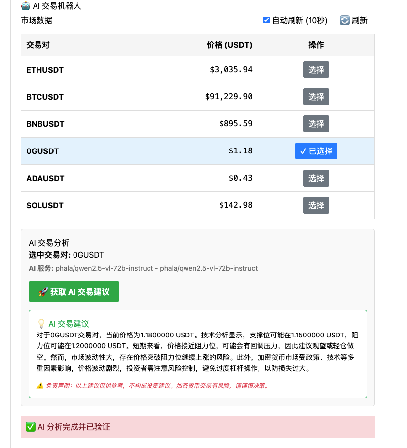

# 0G Broker Starter Kit

这是一个使用 0G Serving Broker 的简单示例项目，专为初学者设计，展示如何构建去中心化 AI 应用。

## 功能概览

本项目实现了 0G Serving Broker 的核心功能：

1. **Broker 实例构建** - 创建和初始化 broker 连接
2. **账户充值** - 管理账本和充值 A0GI 代币
3. **服务验证** - 验证 AI 服务提供者
4. **Chat 对话** - 与 AI 模型进行交互
5. **内容验证** - 验证 AI 回复的真实性
6. **🤖 AI 交易机器人** - 获取实时加密货币市场数据，并通过 AI 获取交易建议

## 核心概念

### 1. Broker 实例

```typescript
import { createZGComputeNetworkBroker } from "@0glabs/0g-serving-broker";

// 使用钱包签名者创建 broker
const broker = await createZGComputeNetworkBroker(signer);
```

### 2. 账本管理

```typescript
// 创建账本并充值
await broker.ledger.addLedger(amount);

// 为已有账本充值
await broker.ledger.depositFund(amount);

// 查询账本信息
const { ledgerInfo } = await broker.ledger.ledger.getLedgerWithDetail();
```

### 3. 服务验证

```typescript
// 获取服务元数据
const metadata = await broker.inference.getServiceMetadata(providerAddress);

// 验证服务（acknowledge）
await broker.inference.acknowledge(providerAddress);

// 检查是否已验证
const isAcknowledged = await broker.inference.userAcknowledged(providerAddress);
```

### 4. Chat 对话

```typescript
// 获取请求头（包含认证信息）
const headers = await broker.inference.getRequestHeaders(
  providerAddress,
  JSON.stringify(messages)
);

// 发送请求到 AI 服务
const response = await fetch(`${endpoint}/chat/completions`, {
  method: "POST",
  headers: { ...headers },
  body: JSON.stringify({ messages, model, stream: true }),
});
```

### 5. 内容验证

```typescript
// 处理响应并验证内容
const isValid = await broker.inference.processResponse(
  providerAddress,
  responseContent,
  chatId
);
```

## 快速开始

### 安装依赖

```bash
pnpm install
```

### 配置项目

1. 创建 `.env` 文件并设置 WalletConnect Project ID：

```bash
NEXT_PUBLIC_PROJECT_ID=your_project_id_here
```

获取 Project ID：访问 [https://cloud.walletconnect.com](https://cloud.walletconnect.com) 注册并创建项目。

### 运行项目

```bash
pnpm run dev
```

访问 http://localhost:3000

## 使用流程

### ⚠️ 重要提示

**在使用任何功能前，请确保账户余额充足！**

- **最低充值要求**：建议充值 **2 个 A0GI 或以上**
- **原因**：系统需要为每个服务提供者创建子账户并充值，每次对话也会消耗代币
- **不足影响**：余额不足会导致服务调用失败

### 详细步骤

1. **连接钱包**

   - 使用 MetaMask 或其他钱包连接到 0G 测试网
   - 确保钱包中有足够的 A0GI 测试网代币

2. **创建账本并充值** ⚡

   - 在"账户"标签页创建账本
   - **充值至少 2 个 A0GI**（推荐 5-10 个以获得更好体验）
   - 在钱包中确认交易
   - 等待交易完成，确认余额显示正确

3. **验证服务**

   - 在"服务"标签页选择 AI 服务提供者
   - 点击"验证服务"按钮
   - 在钱包中确认交易

4. **使用功能**

   - **Chat 对话**：在"聊天"标签页与 AI 进行对话
   - **交易机器人**：在"交易机器人"标签页获取加密货币交易建议
     - 查看实时币安市场数据（BTC, ETH, BNB, SOL, ADA）
     - 选择交易对
     - 获取 AI 驱动的交易分析和建议

5. **验证内容**
   - 系统会自动验证 AI 回复的真实性
   - 查看验证状态标识

## 项目结构

```
0g-broker-starter-kit/
├── components/              # React 组件
│   ├── AccountTab.tsx       # 账户管理组件
│   ├── ServiceTab.tsx       # 服务验证组件
│   ├── ChatTab.tsx          # Chat 对话组件
│   └── TradingBotTab.tsx    # AI 交易机器人组件
├── pages/                   # Next.js 页面
│   ├── _app.tsx             # 应用配置
│   └── index.tsx            # 主页
└── styles/                  # 样式文件
    └── globals.css          # 全局样式
```

## 功能截图

### 🤖 AI 交易机器人



交易机器人功能展示：实时市场数据、交易对选择、AI 交易建议和风险提示。

## 🤖 交易机器人功能

交易机器人标签页提供以下功能：

- **实时市场数据**：从币安期货 API 获取实时价格（BTCUSDT, ETHUSDT, BNBUSDT, SOLUSDT, ADAUSDT）
- **自动刷新**：每 10 秒自动更新一次市场数据
- **AI 交易分析**：使用 0G Compute Network 获取专业的交易建议
  - 技术分析观点（支撑位、阻力位）
  - 交易建议（做多/做空/观望）
  - 风险提示
- **去中心化验证**：所有 AI 响应都在链上验证，确保真实性

### 使用交易机器人

1. 完成账户充值（至少 2 A0GI）和服务验证
2. 前往"交易机器人"标签页
3. 查看实时市场数据
4. 选择感兴趣的交易对
5. 点击"获取 AI 交易建议"
6. 查看 AI 分析结果

> ⚠️ **免责声明**：AI 建议仅供参考，不构成投资建议。加密货币交易有风险，请谨慎决策。

## 相关资源

- [0G Labs 文档](https://docs.0g.ai)
- [0G Serving Broker NPM](https://www.npmjs.com/package/@0glabs/0g-serving-broker)
- [WalletConnect](https://cloud.walletconnect.com)
- [币安 API 文档](https://binance-docs.github.io/apidocs/futures/en/)
